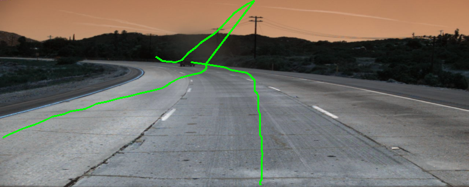
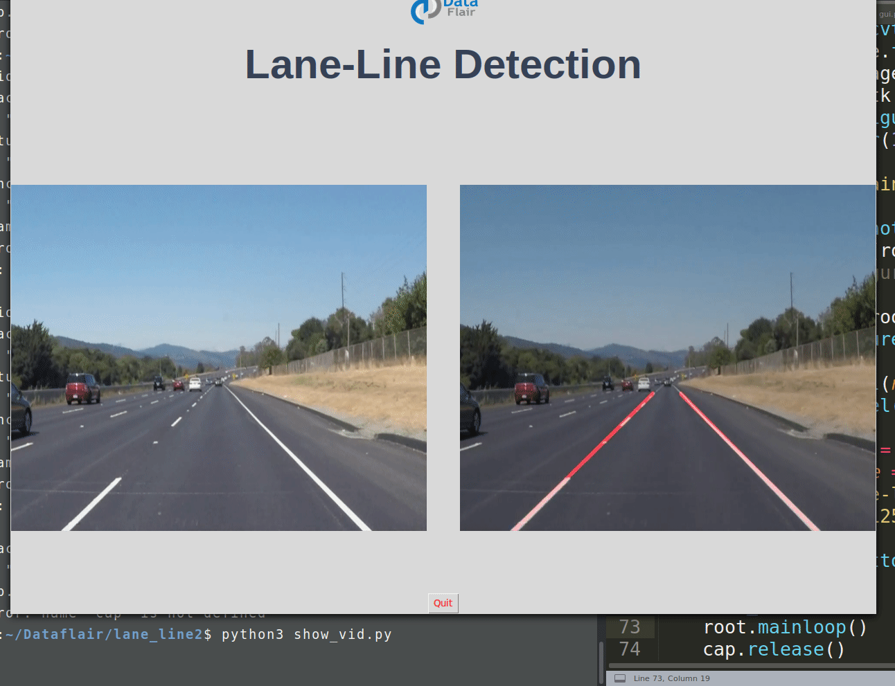
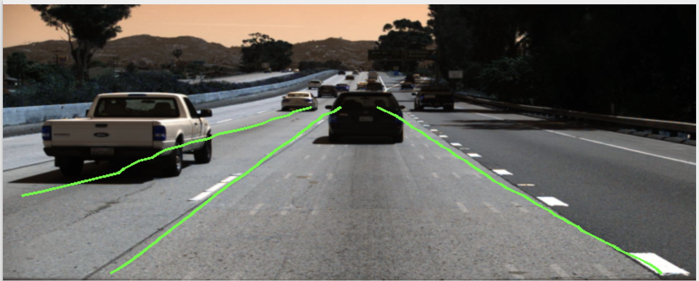
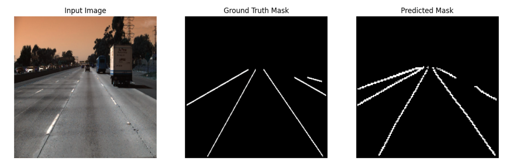
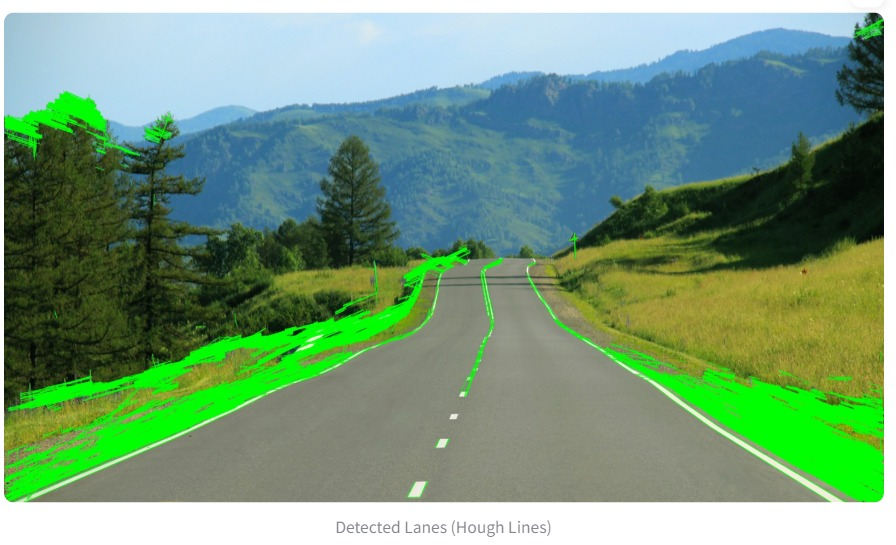
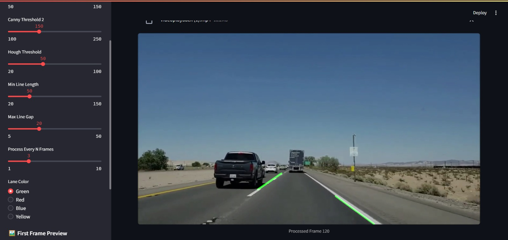

看到论文[arxiv:2402.17172](https://arxiv.org/abs/2402.17172)想跑跑试试，只在[rishi02102017/LaneNet-Vision](https://github.com/rishi02102017/LaneNet-Vision)的仓库里找到了源码，拿TUSimple训练了50个epoch，效果很差..不知道是我哪里整错了[best_model.pth](https://vip.123pan.cn/1820473715/18706752)

<p align="center">
  
</p>

pretraining_vit是去下载的vit-base-patch16-224：

```
git lfs install
git clone https://huggingface.co/google/vit-base-patch16-224
```

---

<h1 align="center">Lane Detection using Traditional and Deep Learning Approaches 🚗</h1>

<p align="center">
  
</p>

## Project Overview

This project addresses the problem of **lane detection**, a critical task for autonomous driving systems that helps vehicles stay on course. Lane detection plays a crucial role in lane-keeping systems, navigation, and autonomous driving, where detecting lane boundaries accurately is essential for safe operation.

The project explores two distinct approaches to lane detection:

1. **Traditional Approach**: A classical computer vision pipeline using edge detection, Hough transform, and polynomial fitting.
2. **Lane2Seq (Deep Learning-based Approach)**: A state-of-the-art transformer-based approach that reformulates lane detection as a sequence generation task.

---

## Approaches

### 1. Traditional Approach

The **Traditional Approach** leverages classical computer vision techniques for lane detection. This method operates by applying a series of image processing steps to extract lane boundaries from road images.

Key steps in the pipeline:

- **Color Space Transformation**: The image is transformed into the HLS color space to enhance lane visibility, particularly for white and yellow lanes.
- **Hough Transform**: for Line Detection: Using the Probabilistic Hough Transform
  to detect linear lane segments from edge-detected images within the ROI.
- **Edge Detection using Canny**: Detecting lane boundaries by applying the Canny
  edge detector, which highlights strong gradient changes associated with lane lines.
- **Multi-Threshold Detection**: Applying specific color thresholds to isolate lane mark-
  ings based on their distinctive hue and lightness properties.
- **Gradient-Based Edge Detection**: Using Sobel operators to identify vertical edges
  corresponding to lane boundaries.
- **Region of Interest (ROI) Masking**: A trapezoidal mask is applied to focus processing on the road area and ignore irrelevant regions.
- **Perspective Transformation**: A homography is applied to transform the perspective to a bird’s-eye view, making lane lines appear parallel.
- **Sliding Window Detection**: Lane positions are identified through histogram analysis, tracking them vertically using adaptive windows.
- **Polynomial Fitting**: Lanes are represented as second-degree curves (ax² + bx + c) to model their shape and curvature.
- **Slope-Based Lane Classification**: Separating detected lines into left and right lanes
  based on the sign and magnitude of their slope, eliminating horizontal and vertical
  noise.
- **Dynamic Line Averaging**: Averaging multiple line segments on both sides to pro-
  duce a stable representation of left and right lane boundaries.
- **Real-Time Frame Processing**: Processing live video streams frame-by-frame using
  OpenCV, with frame skipping for efficiency and smooth playback.
- **Interactive Parameter Tuning**: Providing user control over edge detection, line
  detection, and frame rate settings via Streamlit sliders, enabling dynamic adjustment
  to different lighting and road conditions.
- **Lane Overlay Visualization**: Overlaying detected lanes on original video frames
  using weighted blending to visualize results in real-time for user validation

This method is implemented using **OpenCV** and provides real-time lane detection for video streams, with dynamic parameter tuning via a **Streamlit interface**.

### 2. Lane2Seq (Deep Learning-based Approach)

The **Lane2Seq** approach represents lane detection as a **sequence generation problem** using **transformer-based architecture**. The goal is to use a unified model that can handle multiple lane detection formats, including segmentation-based, anchor-based, and polynomial-based formats.

Key aspects of the Lane2Seq pipeline:

- **Vision Transformer (ViT)**: The encoder is based on ViT, which extracts global contextual features from input images. The image is divided into non-overlapping patches and tokenized.
- **Sequence Decoder**: A transformer decoder generates lane token sequences autoregressively based on the image features and preceding tokens.
- **Pre-training**: Before fine-tuning on the lane detection task, the ViT encoder is pre-trained using a **Masked Autoencoder (MAE)** strategy on an unlabeled dataset to learn meaningful spatial and contextual representations.
- **Fine-tuning**: The encoder is fine-tuned with supervised learning using cross-entropy loss to generate lane sequences from input images.
- **Inference**: At inference time, the model generates lane sequences token-by-token, which are later decoded into lane coordinates or parameters.
- **Semantic Segmentation**: for Lane Detection: As part of the Lane2Seq pipeline, we implemented the traditional semantic segmentation approach using PyTorch. This involved training a neural network to predict lane masks from input images, using binary cross-entropy (BCE) loss for pixel-level lane detection. The segmentation model was trained on the TuSimple dataset, and the predicted lane masks were compared to the ground truth masks.
- **Model Training and Inference**: We worked on preprocessing the dataset, setting up the training pipeline, and evaluating the model's performance. The trained model provided a baseline for lane detection that could be compared with the more advanced Lane2Seq sequence generation approach.

Lane2Seq eliminates the need for task-specific heads or post-processing steps, making it a flexible and scalable solution for lane detection tasks. The semantic segmentation model serves as an essential comparison point, highlighting the advantages of sequence generation methods over pixel-wise segmentation in terms of flexibility and efficiency.

---

## Dataset Description

The project uses the **TuSimple Dataset**, a widely used benchmark for lane detection. This dataset contains highway-centric images with well-defined lanes and minimal occlusions, making it ideal for evaluating lane detection systems.

- **Number of images**: 3,626 training samples and 2,782 testing samples.
- **Resolution**: 1280 × 720 pixels.
- **Annotations**: Lane positions are provided as x-coordinates at fixed y-positions for each image.

---

## Results

### Quantitative Results

We evaluated both the traditional approach and the Lane2Seq model on the TuSimple dataset. The evaluation metrics include:

- **Precision**: The proportion of correctly predicted lane pixels to the total predicted lane pixels.
- **Recall**: The proportion of correctly predicted lane pixels to the total ground-truth lane pixels.
- **F1-score**: The harmonic mean of precision and recall, providing a balanced measure of performance.

Before reinforcement learning tuning, the Lane2Seq model achieved the following performance:

- **Precision**: 0.3913
- **Recall**: 0.2897
- **F1-score**: 0.3259

### Qualitative Results

The following figures display lane detection outputs for both approaches, showcasing the capabilities of the Lane2Seq model in various formats (segmentation, anchor, and parameter-based) as well as the traditional method's output.

## 📸 Lane2Seq Outputs




---

## 📸 Traditional Approach Outputs



### Traditional Approach Results

The traditional approach successfully detects lanes in clear road conditions and demonstrates reliable lane detection with real-time video processing. However, it may struggle with complex road scenarios such as occlusions, sharp curves, and varying lighting conditions.



---

## Conclusion

This project successfully implemented two distinct approaches to lane detection:

1. A traditional computer vision pipeline using edge detection and polynomial fitting.
2. A deep learning-based sequence generation approach using transformer architecture (Lane2Seq).

The results demonstrate that both methods are effective for lane detection, with the deep learning-based approach offering more flexibility and scalability across different formats. Future work could involve integrating reinforcement learning to further enhance performance and generalization across various driving conditions.

---

## Links

- **GitHub Repository**: [CV-Project GitHub](https://github.com/rishi02102017/CV-Project)
- **Streamlit App**: [Streamlit Demo](https://cv-project-vckwe3tm6ucgc73a3ylxzw.streamlit.app/)

---

## Instructions to Run Locally

### For Traditional Approach:

1. Install dependencies:
   ```bash
   pip install -r requirements.txt
   ```
2. Run the Streamlit app:
   ```bash
   streamlit run app.py
   ```

### For Lane2Seq (Deep Learning Approach):

1. Install dependencies:
   ```bash
   pip install -r requirements.txt
   ```
2. Run the training or inference script:
   ```bash
   python train.py  # For training
   python inference.py  # For inference
   ```

---

---

## Future Work

- **Training on larger datasets**: Expand training to include larger and more diverse datasets like **CULane** and **LLAMAS** for better generalization.
- **Transformer Decoding Enhancement**: Improve the transformer decoding process by implementing **beam search** or other advanced decoding strategies.
- **Camera Calibration Integration**: Implement direct **camera calibration feedback** to improve lane detection accuracy in real-time systems.
- **Reinforcement Learning (RL) Fine-Tuning**: Further refine the model using more complex **RL** setups for robust lane detection under diverse road conditions.

---

## 📜 Citation

If you use this work in your research or projects, please cite it as follows:

```

@article{zhou2023lane2seq, title={Lane2Seq: Towards Unified Lane Detection via Sequence Generation}, author={Kunyang Zhou}, journal={arXiv preprint arXiv:2305.16458}, year={2023} }

```

## 🙏 Acknowledgements

Special thanks to **Kunyang Zhou** for the guidance and response on email, and to the authors of **Pix2Seqv2** and **CLRNet** for making foundational tools open source.

---

## 📌 Authors

- Jyotishman Das
- Pranjal Malik
- Suvigya Sharma
- Shreyansh Pathak
- Shivani Tiwari

---
